# Architecture Diagrams in Mermaid Format
## For Portfolio Integration

These diagrams can be rendered in any Mermaid-compatible viewer or converted to images.

---

## 1. CompileForge Architecture


---

## 2. CompileForge Data Flow


---

## 3. ChainFortress Architecture


---

## 4. ChainFortress Document Flow

```mermaid
flowchart LR
    A[📄 Document] --> B[🔐 AES-256 Encrypt]
    B --> C[📦 IPFS Storage]
    C --> D[⛓️ Smart Contract]
    D --> E[Hash On-chain]
    E --> F[✅ Verified]
    
    style A fill:#3b82f6
    style B fill:#f59e0b
    style C fill:#22c55e
    style D fill:#a855f7
    style E fill:#ec4899
    style F fill:#14b8a6
```



---

## 5. CSG International Architecture


---

## 6. Cinglevue Micro-Frontend Architecture


---

## 7. Cinglevue Migration Journey

```mermaid
graph LR
    A[🏚️ Legacy Monolith<br/>100,000+ LOC] --> B[📋 Analysis<br/>& Planning]
    B --> C[🔧 Incremental<br/>Migration]
    C --> D[🧪 Testing &<br/>Validation]
    D --> E[🏗️ Modern<br/>Micro-Frontends<br/>20+ Modules]
    
    style A fill:#ef4444
    style E fill:#22c55e
```



---

## 8. eBuilder Transaction Pipeline

```mermaid
flowchart LR
    A[🏦 Nordea Bank] --> B[📥 Ingestion]
    B --> C[✅ Validation]
    C --> D[🔄 Processing]
    D --> E[📊 Reporting]
    E --> F[📤 Settlement]
    
    G[1M+ Daily Transactions]
    
    style A fill:#6366f1
    style F fill:#22c55e
```



---

## 9. Skills Distribution


---

## 10. Career Timeline


---

## Usage Instructions

### Converting to Images:
1. Use mermaid.live to render and export as PNG/SVG
2. Use mermaid-cli: `mmdc -i diagrams.md -o output.png`
3. Embed in GitHub README (GitHub supports Mermaid natively)

### Embedding in Portfolio:
```html
<!-- Option 1: Use Mermaid.js library -->
<script src="https://cdn.jsdelivr.net/npm/mermaid/dist/mermaid.min.js"></script>
<div class="mermaid">
  [paste mermaid code here]
</div>

<!-- Option 2: Use pre-rendered images -->

```

### Color Customization:
```javascript
mermaid.initialize({
  theme: 'dark',
  themeVariables: {
    primaryColor: '#6366f1',
    secondaryColor: '#a855f7',
    tertiaryColor: '#22c55e'
  }
});
```
